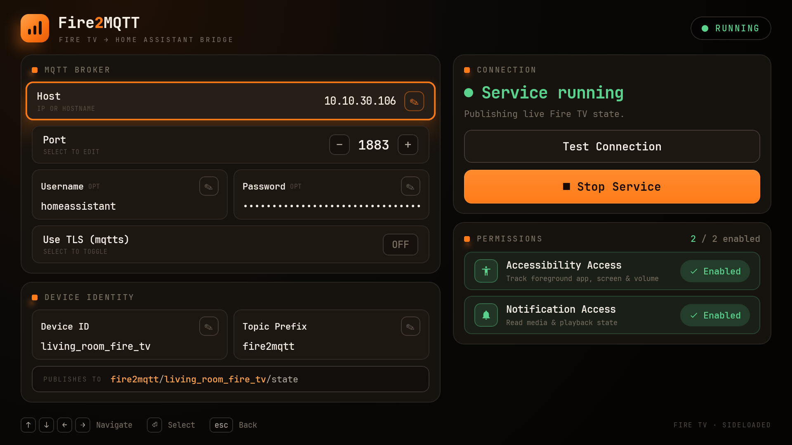

<p align="center">
  
</p>

<h1 align="center">Fire2MQTT</h1>

<p align="center"><strong>Real-time Fire TV Stick integration for Home Assistant via MQTT.</strong></p>

<p align="center">
  No more polling ADB every 5 seconds. A sideloaded APK on your Fire Stick publishes
  state changes via MQTT the moment they happen; a Home Assistant integration
  subscribes and exposes proper entities. The integration also installs and updates
  the APK for you over ADB, so setup is a single config flow.
</p>

<p align="center">
  <a href="https://github.com/Harrypulvirenti/Fire2MQTT/actions/workflows/ci.yml">
    
  </a>
  <a href="https://github.com/Harrypulvirenti/Fire2MQTT/releases">
    
  </a>
  <a href="https://github.com/hacs/integration">
    
  </a>
  <a href="https://www.home-assistant.io/">
    
  </a>
  <a href="LICENSE">
    
  </a>
</p>

> **Early-stage project, help wanted.** Fire2MQTT works well on the devices it's been
> tested on, but it hasn't been exercised across the full range of Fire TV models, Fire OS
> versions, and app builds yet. Some curated app rules, ADB provisioning paths, and
> recovery flows are lightly tested. If you hit a bug, an app that doesn't detect state
> correctly, or a Fire TV model that behaves differently, please [open an
> issue](https://github.com/Harrypulvirenti/Fire2MQTT/issues) or a PR. Testing on more
> devices and contributions are very welcome.

---

## Architecture

```
Fire TV Stick (APK)                MQTT broker               Home Assistant
─────────────────────              ──────────                ──────────────
MediaSessionManager  ┐
AudioPlaybackWatcher ┘─ state/playback ──────────────────▶  media_player
AccessibilityService ──  state/app ─────────────────────▶   sensor: current_app
AudioManager         ──  state/volume ──────────────────▶   sensor: volume
ScreenReceiver       ──  state/screen ──────────────────▶   binary_sensor: screen
InstalledAppsProvider──  state/apps ────────────────────▶   media_player: source_list
                         state/device ──────────────────▶   update entity
                     ◀── cmd/launch ──────────────────────  select + button: launch
                     ◀── cmd/key ─────────────────────────  remote
                     ◀── cmd/media ───────────────────────  media_player services
                     ◀── cmd/volume ──────────────────────  media_player volume
                     ◀── cmd/power ───────────────────────  media_player on/off
```

State is **push-only**: the HA integration never polls. Changes arrive in <100ms.

`AudioPlaybackWatcher` catches apps (e.g. F1 TV) that publish audio playback without
a MediaSession, so they still appear as "playing" in HA.

---

## Screenshots

### Fire TV Stick app



*Screenshot of the Fire2MQTT service app running on your Fire TV Stick.*

---

## What you get

### Entities per device

| Entity | Type | Description |
|--------|------|-------------|
| `media_player.<device>` | Media Player | Playback state (playing/paused/idle/standby/off), title, position, source select, volume, turn on/off |
| `select.<device>_app_launcher` | Select | Choose which curated app to launch (populated from installed apps on your stick) |
| `button.<device>_launch_app` | Button | Launch the app selected above |
| `remote.<device>` | Remote | Key events: HOME, BACK, DPAD_*, MEDIA_*, VOLUME_*, MUTE; turn on/off mirrors screen state |
| `binary_sensor.<device>_playing` | Binary Sensor (running) | True while actively playing |
| `binary_sensor.<device>_screen` | Binary Sensor (power) | Screen on/off |
| `binary_sensor.<device>_connectivity` | Binary Sensor (connectivity) | APK online/offline; always available even when device is offline |
| `sensor.<device>_current_app` | Sensor | Foreground app friendly name |
| `sensor.<device>_current_app_package` | Sensor | Foreground app package name (diagnostic, disabled by default) |
| `sensor.<device>_media_title` | Sensor | Now-playing title |
| `sensor.<device>_media_artist` | Sensor | Now-playing artist |
| `sensor.<device>_volume_level` | Sensor | Volume 0–100% |
| `sensor.<device>_ip_address` | Sensor | Device IP address (diagnostic, disabled by default) |
| `update.<device>_app` | Update | APK version; installs updates over ADB; self-heals signing-key changes |
| `button.<device>_reprovision` | Button (config) | Re-push broker config over ADB; recovery path after factory reset or clean reinstall; always available |

One config entry per Fire Stick. Each gets its own device, all entities above,
and its own MQTT topic namespace (`<prefix>/<device_id>/…`), so multiple sticks
coexist cleanly on one broker.

### Curated app state detection (schema v2)

Out of the box, correct `playing` / `paused` / `idle` states for 14 apps:

**Streaming:** Crunchyroll · Netflix · Prime Video · F1 TV · YouTube · Disney+ · Twitch · Max (HBO) · Apple TV

**Self-hosted:** Jellyfin · Plex · Emby · Kodi

**Music:** Spotify

The `source_list` on your `media_player` entity is populated dynamically from whichever
of the above apps are actually installed on your stick, so source select only shows
what's there.

---

## Prerequisites

- **Fire TV Stick** running Fire OS 7+ (Android 7.1+)
- **ADB debugging enabled** on the stick: Settings → My Fire TV → Developer Options → ADB Debugging ON
- **MQTT broker**, e.g. the [Mosquitto broker add-on](https://github.com/home-assistant/addons/tree/master/mosquitto). Fire2MQTT does not run its own broker.
- **Home Assistant ≥ 2024.12** with the [MQTT integration](https://www.home-assistant.io/integrations/mqtt/) already configured
- **An existing broker username/password**: the Fire TV app connects directly to the broker; HA cannot create broker accounts for you

---

## Installation

### Part 1: Install the HA integration (HACS)

1. In HACS → Integrations → ⋮ → Custom repositories → add `https://github.com/Harrypulvirenti/Fire2MQTT` (category: Integration)
2. Install **Fire2MQTT** and restart Home Assistant
3. Settings → Devices & Services → Add Integration → search **Fire2MQTT**
4. Choose how to install the APK:
   - **Install automatically over ADB** (recommended): enter the Fire TV's IP address and your broker credentials once; HA installs the APK, grants the necessary `WRITE_SECURE_SETTINGS` permission, pushes your broker config to the app, and starts the service. You never touch the Fire TV.
   - **Manual sideload**: install the APK yourself (see [docs/installing-apk.md](docs/installing-apk.md)) and configure the app on-device.
5. Enter a device name and device ID (slug, e.g. `living_room_fire_tv`)

> **Broker credentials tip:** The config flow auto-detects your HA MQTT integration's
> settings and pre-fills the broker host, port, and credentials. For ADB installs it also
> resolves `localhost` / add-on hostnames to the LAN IP so the Fire TV can actually reach
> the broker.

### Part 2: Install the APK on your Fire Stick

Prefer the **Install automatically over ADB** option above. To sideload by hand instead,
see [docs/installing-apk.md](docs/installing-apk.md). Short version:

```bash
adb connect 192.168.1.50
adb install -r apk/app/build/outputs/apk/debug/app-debug.apk
adb shell pm grant dev.harrypulvirenti.fire2mqtt android.permission.WRITE_SECURE_SETTINGS
```

Then open the app on the Fire TV and enter your broker address, username/password
(toggle **TLS** for `mqtts://` on port 8883), and a device ID matching the one in HA.

---

## Configuration options

After setup, open **Configure** on the integration to adjust:

- **Enabled apps**: choose which of the 14 curated apps appear in the source list and get launch buttons. Useful if you want fewer entities or don't have certain apps installed.
- **Idle timeout** (1–120 min, default 10 min): how long the stick can sit on the home screen launcher before the media player state switches from `idle` to `standby`.
- **State detection rules override**: advanced option to supply a custom JSON ruleset that overrides or extends the built-in playback state detection for a specific app.
- **Reconfigure**: update the MQTT topic prefix without removing and re-adding the device.

---

## Keeping the APK up to date

The `update.<device>_app` entity tracks the installed APK version against the latest
GitHub release:

- **One-click update over ADB**: install button pushes the new APK directly to the stick
- **Signing-key self-heal**: if the APK is reinstalled under a new signing key (e.g. switching from a debug to release build), the update entity detects the mismatch and automatically re-provisions broker credentials so the app reconnects without any manual steps
- **Re-provision button**: if the app loses its broker config (e.g. after a factory reset or accidental uninstall), the Re-provision button re-pushes credentials over ADB without a full reinstall

Both the Update entity and the Re-provision button remain available in HA even when the
device is offline, so you can always recover without physical access to the stick.

---

## Example automations

Ready-to-paste automations are in [`examples/automations/`](examples/automations/):

| File | What it does |
|------|--------------|
| `dim_lights_on_playback.yaml` | Dim lights when playing, restore when paused/stopped |
| `pause_on_doorbell.yaml` | Pause when doorbell rings, auto-resume after 60 s |
| `pause_when_room_empty.yaml` | Pause when room empties, resume on return |
| `turn_off_when_idle.yaml` | Sleep after 15 min on home screen |
| `watching_tv_scene.yaml` | Trigger a scene when a streaming app starts playing |

---

## Contributing a new app

See [docs/adding-apps.md](docs/adding-apps.md). The curated rule database is designed
for future upstream contribution to [python-androidtv](https://github.com/JeffLIrion/python-androidtv).

---

## Development

```bash
# Simulate the APK against a local broker (no physical device needed)
pip install paho-mqtt
python3 tools/mqtt_simulator.py --broker 192.168.1.10 --device-id living_room_fire_tv

# Run tests
pip install pytest pytest-homeassistant-custom-component
pytest tests/
```

---

## License

This project is licensed under the **MIT License**: see the [LICENSE](LICENSE) file for the full text.

```
MIT License, Copyright (c) 2025 Harry Pulvirenti (@harrypulvirenti)

Permission is hereby granted, free of charge, to any person obtaining a copy of
this software to use, copy, modify, merge, publish, distribute, sublicense,
and/or sell copies, subject to the conditions in the LICENSE file.
```

© 2025 [Harry Pulvirenti](https://github.com/harrypulvirenti)
